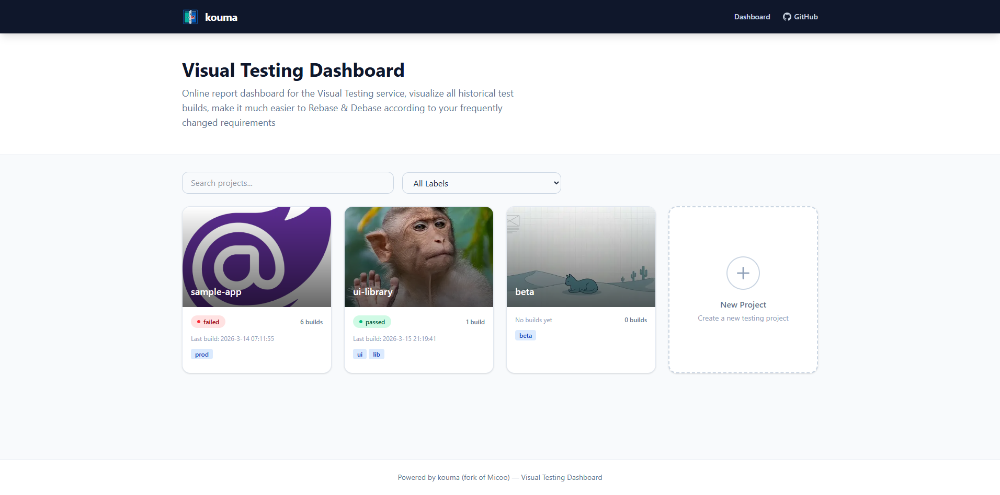
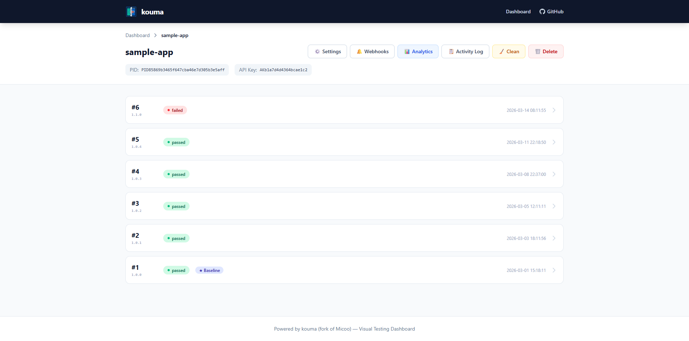
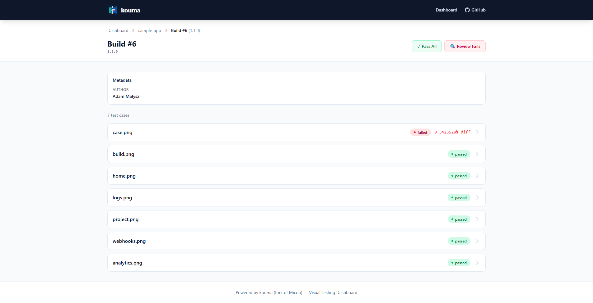

# Kouma

Kouma is a **pixel-based screenshot comparison solution** for visual regression testing. It helps you catch unintended visual changes in your application by comparing screenshots against a known baseline.

## What Kouma Offers

- **Pixel-Based Comparison:** Precise visual regression detection comparing screenshots pixel-by-pixel with configurable color thresholds and antialiasing support.
- **Web Dashboard:** Inspect test results, review visual mismatches, and maintain baseline builds through an intuitive Vue.js interface.
- **Go Engine:** High-performance comparison engine written in Go with concurrent goroutine processing for fast results.
- **CLI & Client Library:** Zero-dependency TypeScript client with CLI, programmatic API, and built-in Cypress integration to upload screenshots and trigger comparisons.
- **Docker Ready:** Quick local setup with Docker Compose and production-ready Kubernetes deployment via Helm charts.
- **Flexible Authentication:** Supports passcode, Microsoft OAuth, and Google OAuth with optional domain restriction.

## How It Works

1. **Take screenshots** in your tests using any framework (Cypress, Playwright, Selenium, etc.).
2. **Upload screenshots** to Kouma using the CLI, client library, or Cypress plugin.
3. **Kouma compares** each screenshot against the baseline pixel-by-pixel.
4. **Review results** in the web dashboard — approve changes or flag regressions.
5. **Maintain baselines** by rebasing builds when visual changes are intentional.

## Architecture Overview

Kouma consists of four main services running as Docker containers and communicating through an internal network:

| Service       | Technology  | Purpose                        |
| ------------- | ----------- | ------------------------------ |
| **Dashboard** | Bun + Vue 3 | Web UI and REST API            |
| **Engine**    | Go          | Screenshot comparison          |
| **MongoDB**   | MongoDB 4+  | Data storage                   |
| **Nginx**     | Nginx       | Reverse proxy and file serving |

## Quick Start

### Docker Compose

```bash
git clone https://github.com/kkiwior/kouma.git
cd kouma
docker-compose up
```

Open [http://localhost:8123](http://localhost:8123) in your browser.

### Kubernetes with Helm

```bash
helm install kouma oci://ghcr.io/kkiwior/charts/kouma
```

## Packages

| Package | Address |
| --- | --- |
| Dashboard image | `ghcr.io/kkiwior/kouma/dashboard` |
| Engine image | `ghcr.io/kkiwior/kouma/engine` |
| Helm chart | `oci://ghcr.io/kkiwior/charts/kouma` |
| npm client | [`kouma`](https://www.npmjs.com/package/kouma) |

## Screenshots







## Documentation

For more information, installation instructions, and guides, please refer to the documentation in the `docs/` directory or [GitHub pages](https://kkiwior.github.io/kouma/).

## Credits

This project is a fork of [Micoo](https://github.com/Mikuu/Micoo).
